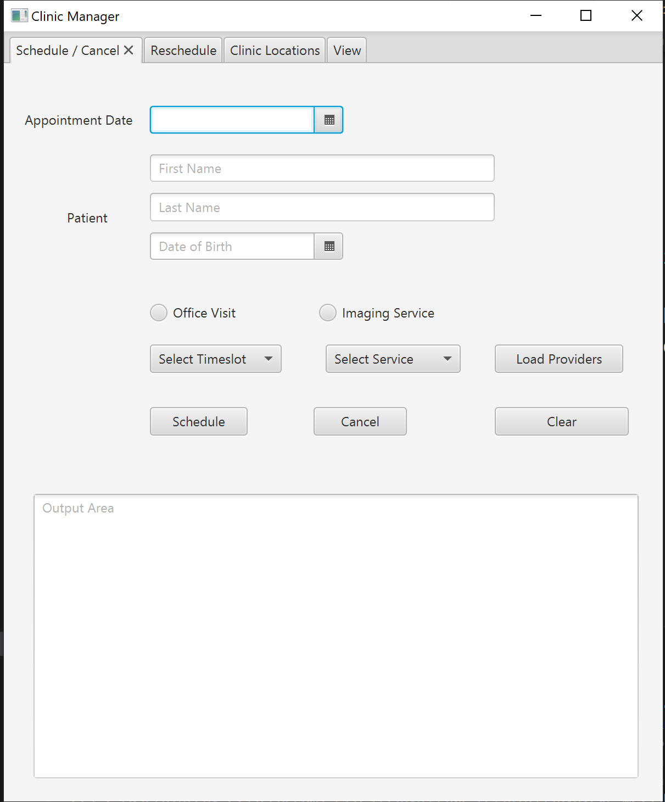
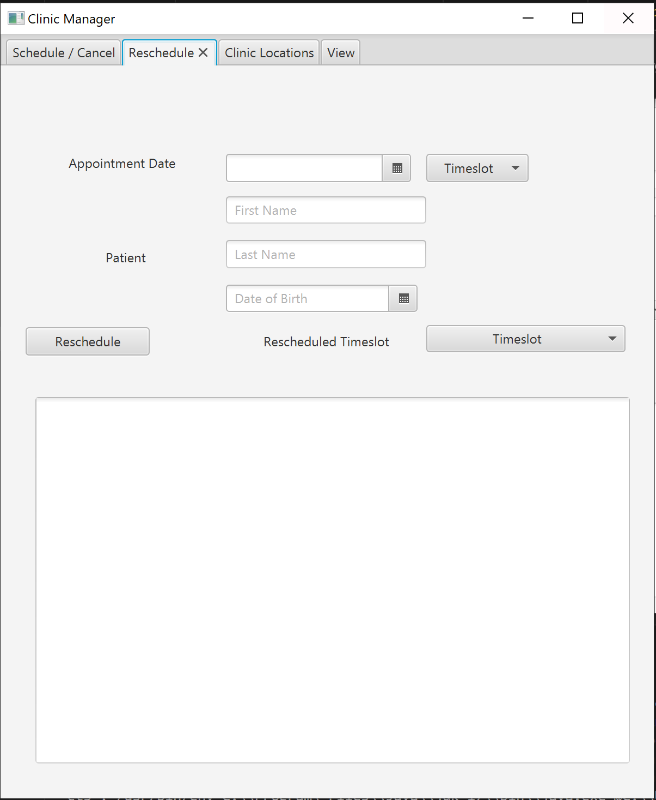
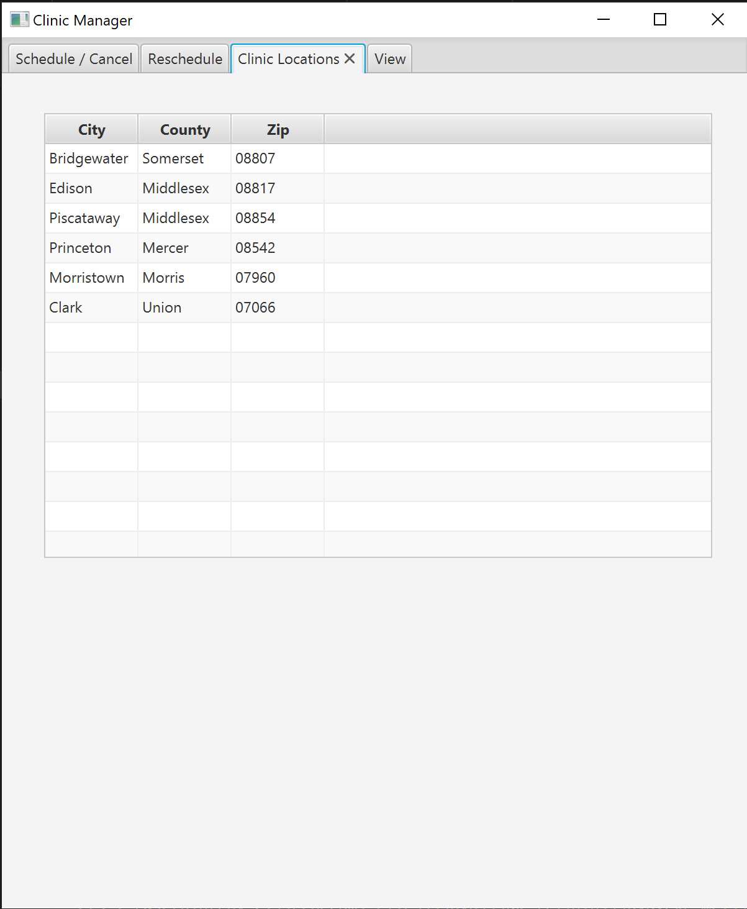
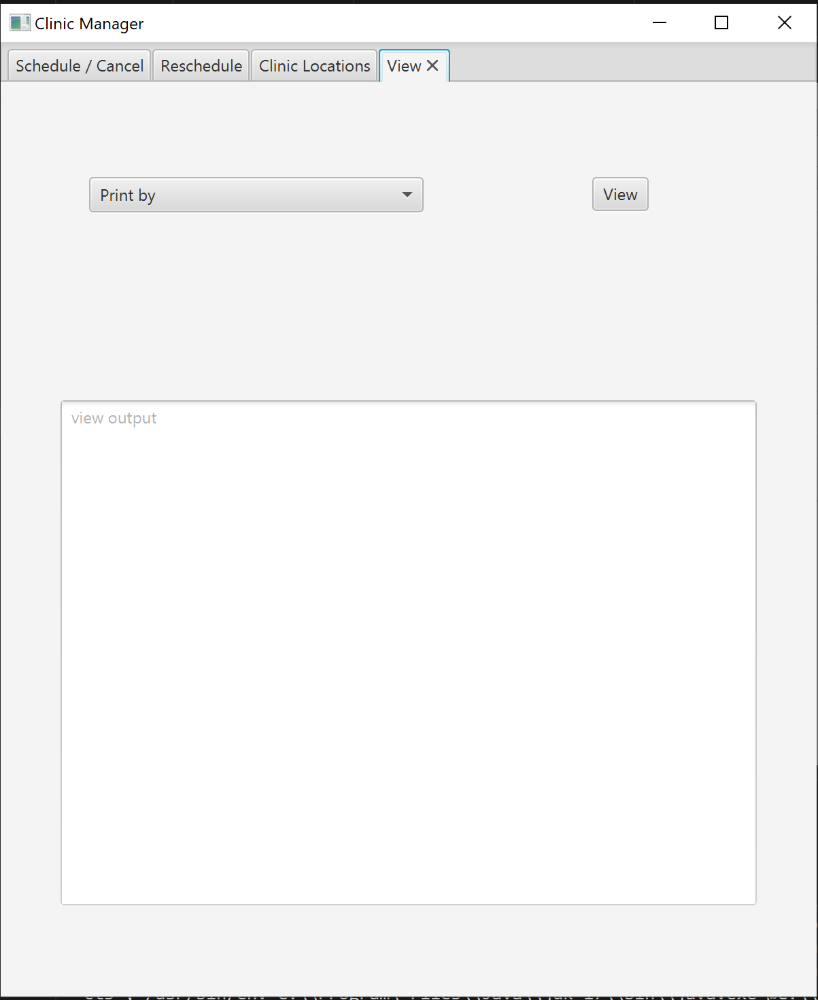

# Clinic Management System

A comprehensive appointment management system for medical clinics that handles both office visits and imaging services. The system provides both a command-line interface (CLI) and a graphical user interface (GUI) for managing patient appointments, provider schedules, and generating various reports.

## Features

### Appointment Management
- Schedule office visits with doctors
- Schedule imaging services with technicians
- Cancel existing appointments
- Reschedule appointments
- Validate date and time slot availability
- Track provider schedules

### Reporting Capabilities
- View all appointments (PA)
- View appointments by patient (PP)
- View appointments by location (PL)
- View patient statements (PS)
- View imaging appointments (PI)
- View credits by provider (PC)
- View office appointments (PO)

### System Components
- CLI for command-based interactions
- GUI for user-friendly interface
- Provider management system
- Location tracking
- Time slot management

## Technical Requirements

- Java Development Kit (JDK) 17 or higher
- JavaFX for GUI components
- Maven 3.8.5 or higher

## Installation

1. Clone the repository
2. Ensure JDK is installed and properly configured
3. Ensure Maven is installed and properly configured
4. Place the providers.txt file in the input/ directory

## Running the Application

### Using Maven

1. Open a terminal in the project root directory

2. To run the application with GUI:
```bash
mvn clean javafx:run
```

3. To run the CLI version:
```bash
mvn clean compile exec:java
```

### Command Line Arguments

If you want to run without loading the providers file initially:
```bash
mvn clean compile exec:java -Dexec.args="--no-load"
```

## CI/CD and Releases
This project uses continuous integration (CI) and continuous deployment (CD) pipelines to ensure automated builds, testing, and deployment of the application.

Releases: You can find the latest stable GUI releases in the Releases section of this repository. Each release includes the corresponding .jar file, packaged with all dependencies for easy execution.

To download the latest .jar file, go to the releases page and choose the appropriate version.

## Usage

### Command Line Interface (CLI)

The system accepts the following commands:

```
D - Schedule doctor appointment
T - Schedule technician/imaging appointment
C - Cancel appointment
R - Reschedule appointment
PA - Print all appointments
PP - Print appointments by patient
PL - Print appointments by location
PS - Print statements by patient
PI - Print imaging appointments
PC - Print credits by provider
PO - Print office appointments
Q - Quit the program
```

#### Command Format
All commands use comma-separated values:
```
D,MM/DD/YYYY,timeslot,firstname,lastname,MM/DD/YYYY,providerID
T,MM/DD/YYYY,timeslot,firstname,lastname,MM/DD/YYYY,service
```

### Graphical User Interface (GUI)

The GUI provides intuitive access to all system features through:
- Drop-down menus for selecting providers and time slots
- Date pickers for appointment scheduling
- Radio buttons for selecting appointment types
- Dedicated tabs for different functions
- Clear feedback in output areas

## Schedule Appointments

The **Schedule** tab allows users to book new appointments for patients. Users can:
- Select between office visits and imaging services
- Choose a provider (doctor or technician)
- Pick an available time slot
- Enter patient details (first name, last name, date of birth)

  

## Reschedule Appointments

The **Reschedule** tab enables users to modify existing appointments. Users can:
- Search for an appointment using patient details
- Select a new date and time slot
- Confirm the rescheduled appointment



## Clinic Locations

The **Clinic Locations** tab provides a detailed view of all clinic locations. Users can:
- View locations by city, county, and zip code
- Filter locations based on specific criteria
- Access location-specific details

  
*Placeholder for Clinic Locations Tab screenshot*

## View Tabs

The **View** tab allows users to generate and view various reports. Users can:
- View all appointments (PA)
- View appointments by patient (PP)
- View appointments by location (PL)
- View patient statements (PS)
- View imaging appointments (PI)
- View credits by provider (PC)
- View office appointments (PO)



## Data Formats

### Time Slots
- Morning slots: 9:00 AM - 11:30 AM
- Afternoon slots: 2:00 PM - 4:30 PM
- Each slot is 30 minutes

### Provider Types
- Doctors (for office visits)
- Technicians (for imaging services)

### Locations
- Organized by city, county, and zip code
- Multiple locations supported

## File Structure

```
input/
    providers.txt - Contains provider information
src/
    org/cs213/clinic/
        cli/ - Command line interface components
        core/ - Core business logic
        jfx/ - JavaFX GUI components
        util/ - Utility classes
```

## Error Handling

The system validates:
- Date formats and ranges
- Provider availability
- Patient information
- Time slot availability
- Service type compatibility

## Contributing

1. Fork the repository
2. Create a feature branch
3. Commit your changes
4. Push to the branch
5. Create a Pull Request

## Support

For support or bug reports, please create an issue in the repository's issue tracker.
